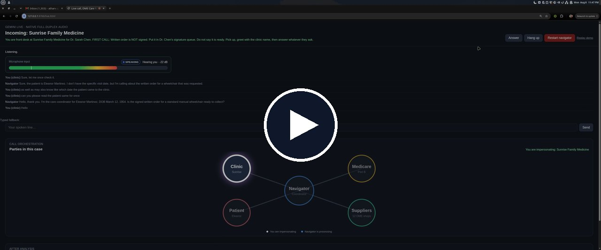

https://github.com/user-attachments/assets/de01babc-d085-4c5b-821d-f9038df41952


[](https://github.com/Atharv-16/dme-care-navigator/blob/main/demo/live-navigator-2x.mp4)

# DME Care Navigator

Live demo at 2x. [Play the video](https://github.com/Atharv-16/dme-care-navigator/blob/main/demo/live-navigator-2x.mp4)

Local **multi-agent** simulation of Medicare DME care coordination for Eleanor's wheelchair case.

You impersonate clinic, patient, suppliers, and Medicare in the browser. **Gemini Live** is the navigator: full-duplex voice, then post-call analysis that updates durable case memory and picks the next party.

## Stack

- **Gemini** for dialogue and structured post-call analysis
- **Gemini Live native audio** for in-browser calls (Chrome or Edge)
- In-process agent bus (no Twilio, no real payer or clinic portals)

## Agents on the bus

| Agent ID | Role |
|---|---|
| `navigator` | Care manager: ranks, decides, calls others |
| `eleanor` | Patient |
| `clinic` | Dr. Sarah Chen / Sunrise Family Medicine reception |
| `medicare` | Part B coverage oracle |
| `supplier:<id>` | One agent per row in `data/suppliers.json` |

## Quick start

```bash
cd ~/Projects/dme-care-navigator
python3 -m venv .venv
source .venv/bin/activate
pip install -r requirements.txt
cp .env.example .env
# put GEMINI_API_KEY in .env (https://aistudio.google.com/apikey)

# Live voice (main path)
python -m src --llm --live-voice
# open http://127.0.0.1:8766/live.html, then Answer when it rings
# optional role filter: LIVE_VOICE_ROLES=clinic,suppliers,patient

# Text-only Gemini dialogue (no browser)
python -m src --llm

# Deterministic e2e (no LLM)
python -m src

python -m src --dry-check
```

Case logs and context JSON → `output/`.

Optional TTS replay of a saved run:

```bash
python -m src --llm --voice
python -m src.demo
# open http://127.0.0.1:8765
```

## Real vs mocked

| Piece | Status |
|---|---|
| Orchestration / ranking / policy | Real code |
| Local agent bus | Real in-process |
| Durable case memory after each call | Real (`output/{case}.context.json`) |
| `--llm` dialogue and analysis | Real **Gemini** |
| `--live-voice` | Real **Gemini Live** native audio |
| Phones / Twilio / portals | Not used |

See `WRITEUP.md` for sequencing, cuts, and what's next.
